## Smart Bicycle - 캡스톤디자인1

SW : 중앙대학교 기계공학부 곽우찬<br>
HW : 중앙대학교 기계공학부 이건휘

## 📖 Gantt :fire:

```mermaid
gantt
    title Smart Bicycle 개발 계획
    dateFormat  YYYY-MM-DD

    section SW
    YOLO 안전모 영상 인식     :a1,2022-04-03  , 30d
    넘어짐 사고 판단 알고리즘 개발 : a2, after a1,  20d
    주행 여부 판단 알고리즘 개발 :after a2 , 20d

    section HW
    설계 컨셉 설정: 2022-03-29, 6d
    브레이크 모듈 설계: 2022-04-04, 21d
    회로시스템 설계 및 테스트: 2022-04-25, 10d
    브레이크 모듈 샘플 확인: 2022-05-05, 10d
    브레이크 모듈 제작: 2022-05-15, 12d
    정션 박스 설계 및 제작: 2022-05-25, 15d
```


# Header 1
## Header 2
### Header 3

- Bulleted
- List

1. Numbered
2. List

**Bold** and _Italic_ and `Code` text

[Link](url) and 
```

For more details see [Basic writing and formatting syntax](https://docs.github.com/en/github/writing-on-github/getting-started-with-writing-and-formatting-on-github/basic-writing-and-formatting-syntax).

### Jekyll Themes

Your Pages site will use the layout and styles from the Jekyll theme you have selected in your [repository settings](https://github.com/bonawoo/capstone_1/settings/pages). The name of this theme is saved in the Jekyll `_config.yml` configuration file.

### Support or Contact

Having trouble with Pages? Check out our [documentation](https://docs.github.com/categories/github-pages-basics/) or [contact support](https://support.github.com/contact) and we’ll help you sort it out.
